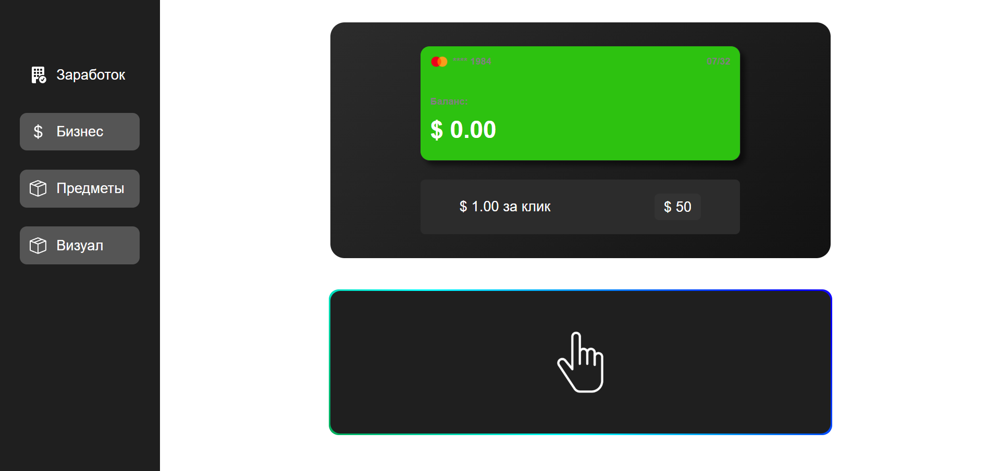

# 🖱️ Кликер-игра



---

## 🛠️ Технологии

- HTML, CSS, JavaScript (Vanilla) 
- SVG-анимации и иконки
- Хранение данных в `localStorage`
- Адаптивный дизайн и звуки интерфейса

---

## 📁 Структура проекта

```bash
📁 assets
│   ├── audio/         
│   ├── images/     
│   ├── test/    
│   └── scripts/        
📁 js
│   ├── test.js
│   └── click-audio.js 
test.html
test.css
LICENSE.txt
```

---

## 🐣 Статус проекта

🔧 В активной разработке. Скоро появятся:
- Новые вкладки
- LocalStorage
- Скрипты

---

## 🤝 Контакты

Разработчик: [@f1cus7](https://github.com/f1cus7)  

---

## 🧾 Лицензия

Этот проект лицензирован по лицензии Creative Commons Attribution-NonCommercial 4.0 International (CC BY-NC 4.0).

Вы можете использовать, изменять и распространять этот проект только в некоммерческих целях, при условии указания авторства.
